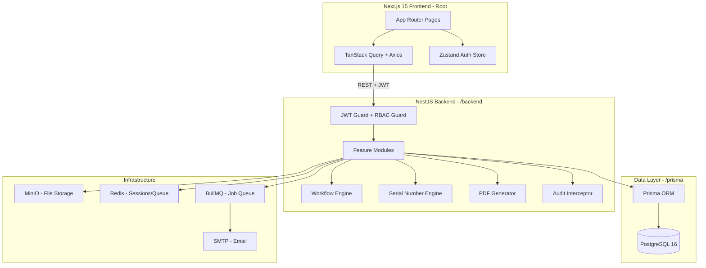
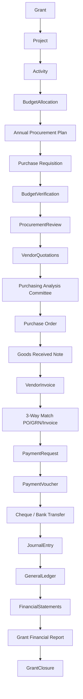
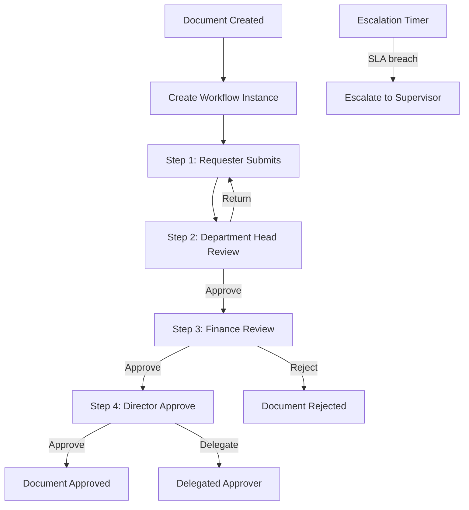
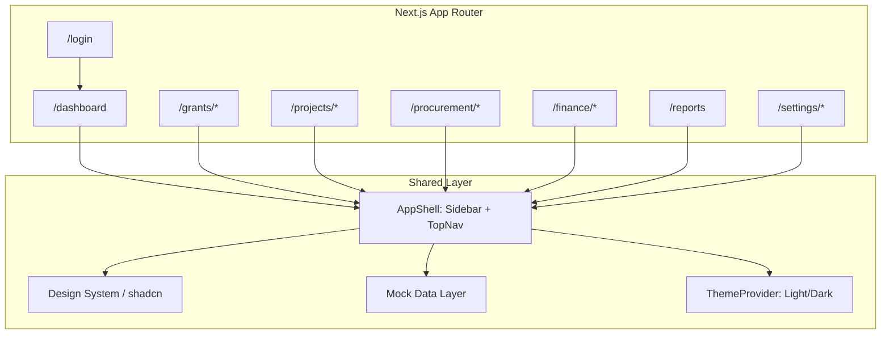

# Gaderon G-GPFMS Enterprise ERP — Master Plan

## Project Identity

| Field | Value |
|---|---|
| **System Name** | Gaderon Grants, Procurement & Financial Management ERP (G-GPFMS) |
| **Organization** | Gaderon Organization for Development |
| **Tenancy** | Single-tenant (Gaderon only) |
| **Classification** | Production Enterprise ERP — not a demo or CRUD app |
| **Comparable to** | Microsoft Dynamics 365, Oracle Fusion, SAP Business One, Odoo Enterprise |
| **SRS Status** | This document IS the official Software Requirements Specification |

---

## Current State (Prototype Complete)

The existing codebase at `C:\Users\IT\Documents\IPFMS` is a **fully completed UI prototype**:

- 30+ screen routes in Next.js 15 App Router with Gaderon design system (`#00AEEF`)
- Typed domain model in [`src/types/index.ts`](src/types/index.ts)
- Static mock data in [`src/lib/mock-data/`](src/lib/mock-data/)
- Fake localStorage auth in [`src/lib/auth.ts`](src/lib/auth.ts)
- **Zero backend, zero database, zero real auth** — entire backend layer is greenfield

---

## Target Production Architecture



---

## Full Repository Layout

```
IPFMS/
├── src/                          # Existing Next.js 15 frontend (UI stays intact)
│   ├── app/                      # 30+ App Router pages (all screens complete)
│   ├── components/               # Gaderon design system + feature components
│   ├── hooks/                    # use-sidebar, use-grant-context, use-toast
│   ├── lib/
│   │   ├── api/                  # NEW — Axios client + TanStack Query hooks
│   │   ├── mock-data/            # DEPRECATED after phase-by-phase migration
│   │   ├── auth.ts               # REPLACE — localStorage → Zustand + JWT
│   │   ├── utils.ts
│   │   └── formatters.ts
│   └── types/
│       └── index.ts              # Domain types (→ will sync with Prisma generated types)
│
├── backend/                      # NEW — NestJS application
│   ├── src/
│   │   ├── auth/                 # JWT, refresh tokens, Argon2
│   │   ├── users/
│   │   ├── rbac/                 # Dynamic RBAC, roles, permissions
│   │   ├── grants/
│   │   ├── projects/
│   │   ├── procurement/
│   │   │   ├── annual-plan/
│   │   │   ├── requisitions/
│   │   │   ├── vendors/
│   │   │   ├── rfq/
│   │   │   ├── purchase-orders/
│   │   │   ├── goods-receipt/
│   │   │   └── contracts/
│   │   ├── finance/
│   │   │   ├── chart-of-accounts/
│   │   │   ├── journal-entries/
│   │   │   ├── payments/
│   │   │   └── bank-reconciliation/
│   │   ├── inventory/
│   │   ├── assets/
│   │   ├── workflow/             # Configurable workflow engine
│   │   ├── serial/               # Serial number engine
│   │   ├── pdf/                  # PDF generation service
│   │   ├── notifications/        # Email + in-app via BullMQ
│   │   ├── audit/                # Global audit interceptor
│   │   ├── reports/
│   │   └── common/               # Guards, filters, decorators, pipes
│   ├── package.json
│   └── tsconfig.json
│
├── prisma/                       # NEW — Shared Prisma schema
│   ├── schema.prisma             # 85+ table schema
│   ├── migrations/
│   └── seed/
│       ├── index.ts
│       ├── users.ts
│       ├── grants.ts
│       └── lookup-data.ts        # Roles, permissions, currencies, methods
│
├── docs/                         # NEW — 10 specification documents
│   ├── 01_System_Architecture.md
│   ├── 02_Business_Requirements.md
│   ├── 03_Workflows.md
│   ├── 04_Database_Design.md
│   ├── 05_API_Specification.md
│   ├── 06_RBAC_Permissions.md
│   ├── 07_UI_UX_Guidelines.md
│   ├── 08_Coding_Standards.md
│   ├── 09_Deployment.md
│   └── 10_Testing_Strategy.md
│
├── .env.example                  # NEW
└── package.json                  # Updated root (workspace scripts)
```

---

## Database Design — 85 Tables Across 10 Domains

### Domain Overview

```mermaid
flowchart LR
  subgraph core [Core - 8 tables]
    users --> roles --> permissions
    organizations --> departments
    settings
    serial_sequences
  end

  subgraph grants [Grants - 9 tables]
    grants --> grant_budget_lines
    grants --> grant_amendments
    donors --> grants
    currencies --> exchange_rates
    fiscal_years --> accounting_periods
  end

  subgraph projects [Projects - 5 tables]
    projects --> milestones
    projects --> activities
    grants --> projects
  end

  subgraph procurement [Procurement - 20 tables]
    appTable[annual_procurement_plans] --> purchase_requisitions
    purchase_requisitions --> rfqs
    rfqs --> purchase_orders
    purchase_orders --> goods_receipts
    purchase_orders --> invoices
    vendors --> rfqs
    contracts --> purchase_orders
  end

  subgraph finance [Finance - 14 tables]
    chart_of_accounts --> journal_entries --> journal_lines
    bank_accounts --> bank_reconciliations
    payment_vouchers --> payments --> cheques
    payments --> bank_transfers
  end

  subgraph workflow [Workflow - 8 tables]
    workflow_templates --> workflow_steps
    workflow_instances --> workflow_instance_steps
    workflow_actions --> digital_signatures
    delegates
  end

  subgraph inventory [Inventory - 7 tables]
    warehouses --> inventory_items --> stock_movements
    inventory_batches
  end

  subgraph assets [Fixed Assets - 8 tables]
    asset_categories --> fixed_assets
    fixed_assets --> asset_assignments
    fixed_assets --> asset_depreciation
    fixed_assets --> asset_maintenance
  end

  subgraph collab [Collaboration - 6 tables]
    documents --> document_versions --> document_attachments
    comments --> mentions
    notifications
  end

  subgraph auditDomain [Audit - 1 table]
    audit_logs
  end
```

### Critical Schema Patterns

**Serial Number Sequences** — unique per grant + document type:
```
serial_sequences: { grantCode, docType, lastNumber, prefix, format }
USAID-2026 + PR  →  USAID-2026-PR-0001
USAID-2026 + PO  →  USAID-2026-PO-0001
USAID-2026 + GRN →  USAID-2026-GRN-0001
```

**Document Lifecycle State Machine** — applies to ALL 17 business documents:
```
draft → submitted → returned ↩
                 → approved → closed → archived
                 → rejected
                 → cancelled
Every node: version_history + attachments + comments + audit_log
```

**Budget Control** — real-time availability enforced on every commit:
```
grant.totalBudget
  − SUM(budget_lines.committed)    = available_to_commit
  − SUM(purchase_orders.amount)    = committed
  − SUM(payments.amount)           = actual_spent
```

**Multi-Currency** — historical amounts never recalculated:
```
payments: { amount, currency, exchangeRate, exchangeRateDate, convertedAmount, baseCurrency }
exchange_rates: { currency, rate, effectiveDate, grantId } — versioned, immutable
```

---

## Main Business Workflow



---

## Workflow Engine Design



- Workflow templates are **database-driven** — never hardcoded
- Each step stores: approver role, SLA hours, escalation rule, parallel/sequential flag
- Every approval action generates a `digital_signature` record: user, timestamp, IP, browser, device
- Supports: sequential, parallel, conditional, delegation, escalation, reminders

---

## RBAC Matrix

| Module | Super Admin | Finance Mgr | Procurement Mgr | Project Mgr | Auditor | Donor |
|---|---|---|---|---|---|---|
| Grants | CRUD + Approve | Read + Report | Read | Read | Read | Read (portal) |
| Procurement | Full | Read | CRUD + Approve | Requisition | Read | Limited |
| Finance | Full | CRUD + Approve | Read | Read | Read | Report only |
| Workflow | Configure | Approve | Approve | Approve | Read | — |
| Users/RBAC | Full | — | — | — | Read | — |
| Audit | Read | Read | Read | Read | Full | — |

Permissions are stored in the database (`permissions(module, action, resource)`) — never hardcoded.

---

## Serial Number Engine

```
POST /api/serial/next
body: { grantCode: "USAID-2026", docType: "PR" }
→   "USAID-2026-PR-0001"   (atomic, Prisma advisory lock, no duplicates ever)
```

---

## API Pattern — 300+ Endpoints

Every module follows this consistent REST pattern:

```
GET    /api/{module}               list + filter + paginate + sort
POST   /api/{module}               create
GET    /api/{module}/:id           detail
PATCH  /api/{module}/:id           update
DELETE /api/{module}/:id           soft delete (sets deletedAt, never hard deletes)
POST   /api/{module}/:id/submit    workflow: submit for approval
POST   /api/{module}/:id/approve   workflow: approve + digital signature
POST   /api/{module}/:id/reject    workflow: reject with reason
POST   /api/{module}/:id/return    workflow: return for correction
GET    /api/{module}/:id/history   version history
GET    /api/{module}/:id/audit     audit trail
POST   /api/{module}/:id/duplicate
GET    /api/{module}/:id/export/pdf
GET    /api/{module}/:id/export/excel
```

Auth: `POST /api/auth/login` · `POST /api/auth/refresh` · `POST /api/auth/logout` · `GET /api/auth/me`

---

## Frontend Integration Strategy

The existing prototype screens are kept **visually intact**. Integration changes only:

1. `src/lib/auth.ts` localStorage → Zustand auth store + real JWT (HTTP-only cookie option)
2. All `mock-data/*` imports → TanStack Query hooks (`useGrants()`, `usePR()`, `usePO()`, …)
3. New `src/lib/api/` — Axios client with request interceptor (attach Bearer) + response interceptor (auto-refresh on 401)
4. New `src/lib/api/hooks/` — one typed hook file per module
5. Add `middleware.ts` — server-side route protection via JWT validation
6. Clean up: remove duplicate `use-sidebar.ts` (keep `.tsx`), remove duplicate `use-grant-context.ts` (keep `.tsx`)

---

## Key Technical Decisions

| Decision | Choice | Rationale |
|---|---|---|
| Backend | NestJS 10 in `/backend/` | Per SRS; enterprise-grade, decorator-based, testable |
| Database | PostgreSQL 16 + Prisma 5 | Per SRS; full relational integrity, `@@index` on all FKs |
| Auth | JWT (15 min) + Refresh (7d, stored in DB) + Argon2 | Per SRS; secure, stateless-capable |
| File Storage | MinIO (self-hosted S3) | Attachments + generated PDFs; no vendor lock-in |
| Job Queue | BullMQ + Redis | Async PDF generation, email, notifications, escalation timers |
| Search | PostgreSQL `tsvector` full-text | No external search engine; covers all 300+ endpoint payloads |
| Multi-currency | Exchange rates versioned in DB | Historical transactions immutable per SRS |
| Soft deletes | `deletedAt DateTime?` on all tables | Per SRS: "never permanently delete records" |
| PDF engine | `@react-pdf/renderer` (server-side) | Typed, branded PDFs with org logo, QR code, digital signature |
| i18n/RTL | `next-intl` + Cairo font | Arabic ready; Cairo already loaded in root layout |

---

## Implementation Phases

### Phase 1 — Architecture & Foundation
- Create all 10 `/docs` specification files with full business + technical detail
- Create complete `/prisma/schema.prisma` (all 85 tables, all relations, all indexes)
- Configure `.env.example`, PostgreSQL connection, Redis, MinIO
- Scaffold NestJS `/backend`: app module, Prisma service, Swagger, global exception filter, logging
- Implement JWT + Refresh Token + Argon2 auth
- Implement dynamic DB-driven RBAC (guards + `@Permissions()` decorator)
- Implement global audit interceptor (every mutation auto-logged)
- Implement serial number engine (atomic, advisory-locked)
- Connect frontend auth: replace localStorage → real API
- `prisma migrate dev` + seed: admin user, roles, permissions, currencies, procurement methods, sample grant

### Phase 2 — Grants, Projects, Budget
- Grant CRUD, amendments, extensions, closure workflow
- Donor management, exchange rates (versioned), historical rate preservation
- Project + milestone + activity management
- Budget allocation + real-time availability calculation
- Budget control middleware (block over-budget PO commits)

### Phase 3 — Procurement
- Annual Procurement Plan
- Purchase Requisition with configurable multi-level approval workflow
- Vendor registration + compliance documents + expiry alert jobs
- RFQ creation, vendor invitation, evaluation scoring matrix
- Purchasing Analysis Committee form
- Purchase Order generation (auto-linked PR → RFQ → PO chain)
- Goods Receipt Note (3-way match: PO ↔ GRN ↔ Invoice enforcement)
- Service Completion Certificate
- Contract management (LTA, framework, consultancy, service)

### Phase 4 — Finance & Accounting
- Chart of Accounts (hierarchical, IFRS-compliant structure seeded)
- Fiscal year + accounting period management
- Automatic journal posting on PO approval, GRN confirmation, payment
- Payment Request → Payment Voucher → Cheque/Bank Transfer workflow
- Three-way matching enforcement gate before payment approval
- Bank reconciliation (import bank statement, auto-match, manual reconcile)
- Exchange gain/loss auto-calculation
- Trial Balance, Income Statement, Balance Sheet, Cash Flow Statement
- Grant financial statements per donor reporting requirements

### Phase 5 — Inventory & Fixed Assets
- Warehouse + stock management (receive, issue, transfer, adjust)
- Barcode + QR code generation (linked to GRN items)
- Asset registration, category hierarchy, serial numbers, custodian assignment
- Straight-line and reducing-balance depreciation schedules
- Physical verification workflow with mobile-friendly barcode scan UI

### Phase 6 — Reports, PDF, Dashboards, Donor Portal
- Professional PDF generation: PR, PO, GRN, Payment Voucher, Cheque, all reports
- Each PDF: org logo, document number, QR code, digital signature block, approval timeline, watermark, revision number, footer
- All 7 dashboards wired to live data (replace Recharts mock fixtures)
- Donor read-only portal: separate auth scope, grant/activity/procurement/report views only
- Email notifications via BullMQ: approval reminders, budget alerts, contract/vendor document expiry
- Global full-text search across all 13 entity types
- Excel import/export for all modules; import validation with error reporting

---

---

# IPFMS Premium UI/UX Prototype Plan

## Context

- **Starting point:** `[c:\xampp\htdocs\IPFMS](c:\xampp\htdocs\IPFMS)` is empty (greenfield).
- **Goal:** Client-facing presentation prototype — impressive enterprise ERP feel, not a generic admin template.
- **Data:** Static mock fixtures only; fake login redirect; no API/database.
- **Language:** English-only v1; folder structure will reserve hooks for RTL/i18n in a later phase (no `next-intl` in v1).
- **Brand assets:** Copy logo + dashboard illustration from Cursor workspace assets into `[public/brand/](public/brand/)`.

Reference mockup alignment: sky-blue primary (`#00AEEF`), 16px card radius, sidebar + sticky top nav, KPI cards, Recharts, soft shadows, generous whitespace.

---

## Architecture




### Tech scaffold (single init step)

```bash
npx create-next-app@latest . --typescript --tailwind --eslint --app --src-dir --import-alias "@/*"
npx shadcn@latest init
```

**Core dependencies:** `framer-motion`, `recharts`, `@tanstack/react-table`, `react-hook-form`, `zod`, `@hookform/resolvers`, `lucide-react`, `next-themes`, `date-fns`, `clsx`, `tailwind-merge`, `class-variance-authority`.

**Fonts:** `next/font` — Inter (EN body/UI), Cairo loaded but unused in v1 (ready for Arabic pass).

---

## Folder Structure

```
src/
  app/
    (auth)/login/page.tsx
    (dashboard)/layout.tsx          # AppShell wrapper
    (dashboard)/dashboard/page.tsx
    (dashboard)/grants/...
    (dashboard)/projects/...
    (dashboard)/procurement/...
    (dashboard)/finance/...
    (dashboard)/reports/page.tsx
    (dashboard)/settings/...
  components/
    layout/          # sidebar, top-nav, breadcrumbs, page-header
    dashboard/       # kpi-cards, charts, timeline, quick-actions
    grants/          # grant-card, grant-detail
    procurement/     # pr-table, pr-wizard, rfq-comparison, po-print
    finance/         # payment-voucher, approval-timeline
    reports/         # filters, chart-grid, export-bar
    shared/          # data-table, empty-state, loading-skeleton, confirm-dialog
    ui/              # shadcn primitives
  lib/
    mock-data/       # typed fixtures per module
    utils.ts
    formatters.ts    # currency, dates, percentages
  hooks/
    use-sidebar.ts
    use-grant-context.ts   # current grant / fiscal year (top nav)
  types/
    index.ts         # Grant, PR, PO, Payment, etc.
public/
  brand/             # gaderon-logo.png, login-illustration.png
```

---

## Phase 1 — Design System Foundation

### Tailwind theme extension (`[tailwind.config.ts](tailwind.config.ts)`)

Map Gaderon tokens to CSS variables in `[src/app/globals.css](src/app/globals.css)`:


| Token                      | Light     | Dark (derived)          |
| -------------------------- | --------- | ----------------------- |
| `--primary`                | `#00AEEF` | `#33BFEF`               |
| `--secondary`              | `#0089C9` | `#0099D9`               |
| `--background`             | `#F7FAFC` | `#0F172A`               |
| `--card`                   | `#FFFFFF` | `#1E293B`               |
| `--border`                 | `#E5E7EB` | `#334155`               |
| `--success/warning/danger` | per spec  | slightly muted variants |


- Card radius: `--radius: 1rem` (16px) → `rounded-2xl` on cards.
- Shadows: custom `shadow-card` (soft, low spread).
- Typography scale: `text-display`, `text-title`, `text-body`, `text-muted`.

### shadcn/ui components to install

`button`, `input`, `label`, `card`, `badge`, `table`, `tabs`, `dialog`, `dropdown-menu`, `select`, `separator`, `avatar`, `progress`, `skeleton`, `toast` + `toaster`, `sheet` (mobile drawer), `accordion`, `popover`, `calendar`, `checkbox`, `textarea`, `switch`, `breadcrumb`.

### Shared composite components


| Component                                                       | Purpose                                                  |
| --------------------------------------------------------------- | -------------------------------------------------------- |
| `[PageHeader](src/components/layout/page-header.tsx)`           | Title, subtitle, breadcrumbs, primary/secondary actions  |
| `[StatCard](src/components/shared/stat-card.tsx)`               | KPI card with icon, value, subtext, "View details" link  |
| `[DataTable](src/components/shared/data-table.tsx)`             | TanStack Table wrapper: search, filters slot, pagination |
| `[EmptyState](src/components/shared/empty-state.tsx)`           | Icon + message + CTA                                     |
| `[StatusBadge](src/components/shared/status-badge.tsx)`         | Draft/Submitted/Approved/etc. color map                  |
| `[ConfirmDialog](src/components/shared/confirm-dialog.tsx)`     | Destructive action guard                                 |
| `[LoadingSkeleton](src/components/shared/loading-skeleton.tsx)` | Page/card/table skeleton variants                        |


### Motion guidelines (`[src/lib/motion.ts](src/lib/motion.ts)`)

Framer Motion presets only: `fadeIn`, `slideUp`, `scaleIn`, `staggerContainer` — applied to page enter, card hover (`whileHover`), sidebar collapse. No page-wide animation overload.

---

## Phase 2 — App Shell

### Sidebar (`[src/components/layout/app-sidebar.tsx](src/components/layout/app-sidebar.tsx)`)

Nested navigation matching spec:

- **Dashboard**
- **Grant Management**
- **Projects** / **Activities**
- **Procurement** (collapsible): PR, Annual Plan, RFQ, Vendor Quotations, Evaluation Committee, POs, Goods Receipt, Inventory
- **Finance** (collapsible): Payment Voucher, Cheque, Bank Transfer, Accounting, General Ledger
- **Reports**, **Audit**
- **Settings**, **User Management**

Active route: primary blue background, white text (per mockup). Collapsed mode: icon-only + tooltip. Bottom: user profile card (avatar, name, role).

### Top navigation (`[src/components/layout/top-nav.tsx](src/components/layout/top-nav.tsx)`)

- Hamburger (mobile/tablet sidebar toggle)
- Compact logo + org name
- Search input (UI-only, filters mock lists client-side)
- Notifications dropdown (badge count: 4)
- Language switch (disabled placeholder: "AR — Coming soon")
- Dark mode toggle (`next-themes`)
- **Current Grant** + **Fiscal Year** selects (context from mock grants)
- User avatar + role

### Layout behavior

- Desktop-first: fixed 260px sidebar, sticky 64px top bar, scrollable main (`max-w-[1600px]` content area).
- Mobile: sidebar becomes `Sheet`; KPI grid stacks; tables horizontal scroll.
- Every dashboard page uses consistent `[PageHeader](src/components/layout/page-header.tsx)` + breadcrumb trail.

### Fake auth

- `[/login](src/app/(auth)`/login/page.tsx): email/password form (React Hook Form + Zod); any credentials → `localStorage` token → redirect `/dashboard`.
- Middleware or layout guard checks token; unauthenticated → `/login`.

---

## Phase 3 — Mock Data Layer

Typed fixtures in `[src/lib/mock-data/](src/lib/mock-data/)`:

- `grants.ts` — 12 grants, donors, budgets, utilization %
- `dashboard.ts` — KPI aggregates, chart series, recent activities
- `procurement.ts` — PRs with statuses, RFQ vendors, POs, goods receipts
- `finance.ts` — payment vouchers, cheques, bank transfers, journal entries
- `projects.ts` — kanban columns, milestones, staff assignments
- `users.ts` — roles for settings/user management

Current user: **Moayad M.**, Finance Manager (matches mockup). Grant/fiscal year context shared via React context + top-nav selectors.

---

## Phase 4 — Screen Implementation

### 1. Login (`[/login](src/app/(auth)`/login/page.tsx))

- Split layout: left panel with large Gaderon logo, welcome copy, form; right panel with background illustration (`public/brand/login-illustration.png`).
- Fields: email, password, remember me, forgot password link.
- Primary "Sign In" button (brand blue).
- Footer: "Powered by Gaderon".
- Subtle Framer Motion fade on mount.

### 2. Executive Dashboard (`[/dashboard](src/app/(dashboard)`/dashboard/page.tsx))

Match mockup structure:

**Header:** "Welcome back, Moayad" + subtitle + grant filter + date range picker.

**8 KPI cards (2 rows on desktop):** Active Grants, Total Budget, Committed, Actual Expenses, Remaining, Open PRs, Pending Payments, Inventory Value.

**Charts row:**

- Budget vs Actual (Recharts grouped bar — Jan–Jun)
- Grant Utilization (donut — Spent / Committed / Available)
- Monthly Spending (line or area)
- Procurement Status (horizontal bar)
- Cash Flow (composed chart)

**Recent Activities:** timeline with colored icons + relative timestamps.

**Quick Actions:** Create PR, Create Payment, Receive Goods, Generate Report (link to respective create pages).

Include loading skeleton variant (simulated 300ms delay on first mount for demo polish).

### 3. Grant Module (`[/grants](src/app/(dashboard)`/grants/page.tsx))

- **List:** responsive grid of grant cards — donor, dates, currency, budget, available balance, progress bar, utilization badge.
- **Detail** `[/grants/[id]](src/app/(dashboard)`/grants/[id]/page.tsx): tabs for Overview, Activities, Budget, Documents; donor info panel; activity list with progress.

### 4. Projects & Activities (`[/projects](src/app/(dashboard)`/projects/page.tsx))

- View toggle: **Kanban** | **Table** (Tabs).
- Kanban: columns (Planning, In Progress, Review, Completed) with draggable-style cards (visual only, no DnD library needed).
- Table: TanStack Table — milestone, budget allocation, responsible staff, progress %.
- Activity detail drawer: timeline, milestones, budget breakdown.

### 5. Procurement Module


| Route                               | Screen                                                                                       |
| ----------------------------------- | -------------------------------------------------------------------------------------------- |
| `/procurement/requisitions`         | PR list + status badges + filters                                                            |
| `/procurement/requisitions/new`     | 5-step wizard: General → Items → Budget → Attachments → Approval Preview                     |
| `/procurement/rfq`                  | RFQ list                                                                                     |
| `/procurement/rfq/[id]/compare`     | Vendor comparison table + winner highlight row                                               |
| `/procurement/purchase-orders`      | PO list                                                                                      |
| `/procurement/purchase-orders/[id]` | PO detail + **Print layout** (logo, vendor, shipping, bank, T&C, signatures, QR placeholder) |
| `/procurement/goods-receipt`        | Warehouse-style: delivered/accepted/rejected/damaged columns                                 |
| `/procurement/inventory`            | Stock table + inventory value summary                                                        |


PR wizard uses React Hook Form + Zod per step; step indicator component; validation toasts on error.

### 6. Finance Module


| Route                            | Screen                                                      |
| -------------------------------- | ----------------------------------------------------------- |
| `/finance/payment-vouchers`      | List + create                                               |
| `/finance/payment-vouchers/[id]` | Detail: approval timeline, supporting docs, journal preview |
| `/finance/cheques`               | Cheque management table                                     |
| `/finance/bank-transfers`        | Transfer list + status                                      |
| `/finance/accounting`            | Journal entries preview                                     |
| `/finance/general-ledger`        | GL account tree + balances                                  |


Payment voucher detail shows multi-stage approval timeline (submitted → reviewed → approved → paid).

### 7. Reports (`[/reports](src/app/(dashboard)`/reports/page.tsx))

- Filter bar: Grant, Donor, Date range, Project, Department.
- Interactive chart grid (updates from mock filtered data).
- Summary tables below charts.
- Export bar: PDF / Excel / Word buttons → toast "Export simulated for prototype".

### 8. Settings & User Management


| Route             | Screen                                              |
| ----------------- | --------------------------------------------------- |
| `/settings`       | Org profile, fiscal year config, notification prefs |
| `/settings/users` | User table, roles badges, invite modal (UI)         |
| `/audit`          | Audit log table with filters                        |


---

## Phase 5 — Dark Mode

- `next-themes` with `class` strategy on `<html>`.
- All tokens defined in `:root` and `.dark` in globals.css.
- Cards, sidebar, top nav get dark-surface variants; charts use theme-aware Recharts colors via CSS variables.
- Toggle in top nav; persist preference.

---

## Phase 6 — Responsive & Polish

- Breakpoints: `lg` sidebar visible; `md` 2-col KPI; `sm` single column + sheet nav.
- PO print view: `@media print` stylesheet hiding sidebar/top nav.
- Toast notifications for form submit, export, delete confirm.
- Empty states on filtered lists with zero results.
- Confirmation dialogs on destructive actions (cancel PR, reject goods).
- Favicon from Gaderon logo crop.

---

## Quality Bar (Presentation Checklist)

Before client demo, verify:

- [x] Logo and `#00AEEF` consistent on login, sidebar, PO print
- [x] Every module page has breadcrumb + title + at least one primary action
- [x] No lorem ipsum — realistic NGO grant/procurement copy
- [x] Charts render with plausible numbers tied to mock grants
- [x] Mobile: sidebar sheet, readable KPI stack, scrollable tables
- [x] Dark mode: no contrast failures on badges/charts
- [x] Login → dashboard flow works without backend
- [x] Subtle hover on cards/buttons; no animation noise

---

## Implementation Order (Recommended)

Build vertically in this sequence so each phase is demoable:

1. Scaffold + design tokens + shadcn base
2. App shell (sidebar, top nav, theme, fake auth)
3. Login + Dashboard (highest visual impact for client meeting)
4. Grants + Procurement (core NGO workflows)
5. Finance + Reports
6. Projects, Settings, Audit, remaining procurement sub-routes
7. Responsive pass + dark mode audit + print PO

Estimated deliverable: **~45–55 route/component files**, all static, runnable via `npm run dev` on XAMPP host or `localhost:3000`.

---

## Out of Scope (v1)

- Real authentication / API / database
- Full Arabic translations and RTL layout (architecture reserved, not implemented)
- Working PDF/Excel/Word export (toast simulation only)
- Drag-and-drop kanban persistence
- Email notifications

These can be Phase 2 after client approval.