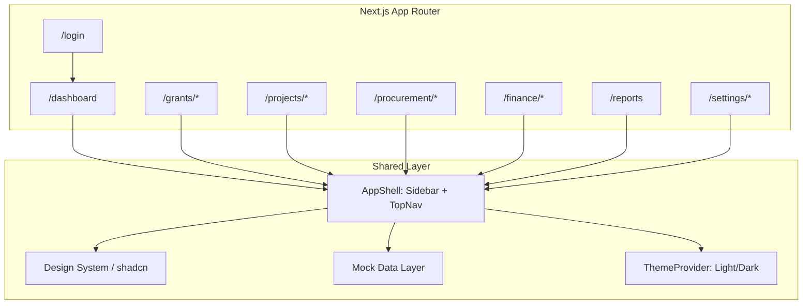

# IPFMS Premium UI/UX Prototype Plan

## Context

- **Starting point:** `[c:\xampp\htdocs\IPFMS](c:\xampp\htdocs\IPFMS)` is empty (greenfield).
- **Goal:** Client-facing presentation prototype — impressive enterprise ERP feel, not a generic admin template.
- **Data:** Static mock fixtures only; fake login redirect; no API/database.
- **Language:** English-only v1; folder structure will reserve hooks for RTL/i18n in a later phase (no `next-intl` in v1).
- **Brand assets:** Copy logo + dashboard illustration from Cursor workspace assets into `[public/brand/](public/brand/)`.

Reference mockup alignment: sky-blue primary (`#00AEEF`), 16px card radius, sidebar + sticky top nav, KPI cards, Recharts, soft shadows, generous whitespace.

---

## Architecture




### Tech scaffold (single init step)

```bash
npx create-next-app@latest . --typescript --tailwind --eslint --app --src-dir --import-alias "@/*"
npx shadcn@latest init
```

**Core dependencies:** `framer-motion`, `recharts`, `@tanstack/react-table`, `react-hook-form`, `zod`, `@hookform/resolvers`, `lucide-react`, `next-themes`, `date-fns`, `clsx`, `tailwind-merge`, `class-variance-authority`.

**Fonts:** `next/font` — Inter (EN body/UI), Cairo loaded but unused in v1 (ready for Arabic pass).

---

## Folder Structure

```
src/
  app/
    (auth)/login/page.tsx
    (dashboard)/layout.tsx          # AppShell wrapper
    (dashboard)/dashboard/page.tsx
    (dashboard)/grants/...
    (dashboard)/projects/...
    (dashboard)/procurement/...
    (dashboard)/finance/...
    (dashboard)/reports/page.tsx
    (dashboard)/settings/...
  components/
    layout/          # sidebar, top-nav, breadcrumbs, page-header
    dashboard/       # kpi-cards, charts, timeline, quick-actions
    grants/          # grant-card, grant-detail
    procurement/     # pr-table, pr-wizard, rfq-comparison, po-print
    finance/         # payment-voucher, approval-timeline
    reports/         # filters, chart-grid, export-bar
    shared/          # data-table, empty-state, loading-skeleton, confirm-dialog
    ui/              # shadcn primitives
  lib/
    mock-data/       # typed fixtures per module
    utils.ts
    formatters.ts    # currency, dates, percentages
  hooks/
    use-sidebar.ts
    use-grant-context.ts   # current grant / fiscal year (top nav)
  types/
    index.ts         # Grant, PR, PO, Payment, etc.
public/
  brand/             # gaderon-logo.png, login-illustration.png
```

---

## Phase 1 — Design System Foundation

### Tailwind theme extension (`[tailwind.config.ts](tailwind.config.ts)`)

Map Gaderon tokens to CSS variables in `[src/app/globals.css](src/app/globals.css)`:


| Token                      | Light     | Dark (derived)          |
| -------------------------- | --------- | ----------------------- |
| `--primary`                | `#00AEEF` | `#33BFEF`               |
| `--secondary`              | `#0089C9` | `#0099D9`               |
| `--background`             | `#F7FAFC` | `#0F172A`               |
| `--card`                   | `#FFFFFF` | `#1E293B`               |
| `--border`                 | `#E5E7EB` | `#334155`               |
| `--success/warning/danger` | per spec  | slightly muted variants |


- Card radius: `--radius: 1rem` (16px) → `rounded-2xl` on cards.
- Shadows: custom `shadow-card` (soft, low spread).
- Typography scale: `text-display`, `text-title`, `text-body`, `text-muted`.

### shadcn/ui components to install

`button`, `input`, `label`, `card`, `badge`, `table`, `tabs`, `dialog`, `dropdown-menu`, `select`, `separator`, `avatar`, `progress`, `skeleton`, `toast` + `toaster`, `sheet` (mobile drawer), `accordion`, `popover`, `calendar`, `checkbox`, `textarea`, `switch`, `breadcrumb`.

### Shared composite components


| Component                                                       | Purpose                                                  |
| --------------------------------------------------------------- | -------------------------------------------------------- |
| `[PageHeader](src/components/layout/page-header.tsx)`           | Title, subtitle, breadcrumbs, primary/secondary actions  |
| `[StatCard](src/components/shared/stat-card.tsx)`               | KPI card with icon, value, subtext, "View details" link  |
| `[DataTable](src/components/shared/data-table.tsx)`             | TanStack Table wrapper: search, filters slot, pagination |
| `[EmptyState](src/components/shared/empty-state.tsx)`           | Icon + message + CTA                                     |
| `[StatusBadge](src/components/shared/status-badge.tsx)`         | Draft/Submitted/Approved/etc. color map                  |
| `[ConfirmDialog](src/components/shared/confirm-dialog.tsx)`     | Destructive action guard                                 |
| `[LoadingSkeleton](src/components/shared/loading-skeleton.tsx)` | Page/card/table skeleton variants                        |


### Motion guidelines (`[src/lib/motion.ts](src/lib/motion.ts)`)

Framer Motion presets only: `fadeIn`, `slideUp`, `scaleIn`, `staggerContainer` — applied to page enter, card hover (`whileHover`), sidebar collapse. No page-wide animation overload.

---

## Phase 2 — App Shell

### Sidebar (`[src/components/layout/app-sidebar.tsx](src/components/layout/app-sidebar.tsx)`)

Nested navigation matching spec:

- **Dashboard**
- **Grant Management**
- **Projects** / **Activities**
- **Procurement** (collapsible): PR, Annual Plan, RFQ, Vendor Quotations, Evaluation Committee, POs, Goods Receipt, Inventory
- **Finance** (collapsible): Payment Voucher, Cheque, Bank Transfer, Accounting, General Ledger
- **Reports**, **Audit**
- **Settings**, **User Management**

Active route: primary blue background, white text (per mockup). Collapsed mode: icon-only + tooltip. Bottom: user profile card (avatar, name, role).

### Top navigation (`[src/components/layout/top-nav.tsx](src/components/layout/top-nav.tsx)`)

- Hamburger (mobile/tablet sidebar toggle)
- Compact logo + org name
- Search input (UI-only, filters mock lists client-side)
- Notifications dropdown (badge count: 4)
- Language switch (disabled placeholder: "AR — Coming soon")
- Dark mode toggle (`next-themes`)
- **Current Grant** + **Fiscal Year** selects (context from mock grants)
- User avatar + role

### Layout behavior

- Desktop-first: fixed 260px sidebar, sticky 64px top bar, scrollable main (`max-w-[1600px]` content area).
- Mobile: sidebar becomes `Sheet`; KPI grid stacks; tables horizontal scroll.
- Every dashboard page uses consistent `[PageHeader](src/components/layout/page-header.tsx)` + breadcrumb trail.

### Fake auth

- `[/login](src/app/(auth)`/login/page.tsx): email/password form (React Hook Form + Zod); any credentials → `localStorage` token → redirect `/dashboard`.
- Middleware or layout guard checks token; unauthenticated → `/login`.

---

## Phase 3 — Mock Data Layer

Typed fixtures in `[src/lib/mock-data/](src/lib/mock-data/)`:

- `grants.ts` — 12 grants, donors, budgets, utilization %
- `dashboard.ts` — KPI aggregates, chart series, recent activities
- `procurement.ts` — PRs with statuses, RFQ vendors, POs, goods receipts
- `finance.ts` — payment vouchers, cheques, bank transfers, journal entries
- `projects.ts` — kanban columns, milestones, staff assignments
- `users.ts` — roles for settings/user management

Current user: **Moayad M.**, Finance Manager (matches mockup). Grant/fiscal year context shared via React context + top-nav selectors.

---

## Phase 4 — Screen Implementation

### 1. Login (`[/login](src/app/(auth)`/login/page.tsx))

- Split layout: left panel with large Gaderon logo, welcome copy, form; right panel with background illustration (`public/brand/login-illustration.png`).
- Fields: email, password, remember me, forgot password link.
- Primary "Sign In" button (brand blue).
- Footer: "Powered by Gaderon".
- Subtle Framer Motion fade on mount.

### 2. Executive Dashboard (`[/dashboard](src/app/(dashboard)`/dashboard/page.tsx))

Match mockup structure:

**Header:** "Welcome back, Moayad" + subtitle + grant filter + date range picker.

**8 KPI cards (2 rows on desktop):** Active Grants, Total Budget, Committed, Actual Expenses, Remaining, Open PRs, Pending Payments, Inventory Value.

**Charts row:**

- Budget vs Actual (Recharts grouped bar — Jan–Jun)
- Grant Utilization (donut — Spent / Committed / Available)
- Monthly Spending (line or area)
- Procurement Status (horizontal bar)
- Cash Flow (composed chart)

**Recent Activities:** timeline with colored icons + relative timestamps.

**Quick Actions:** Create PR, Create Payment, Receive Goods, Generate Report (link to respective create pages).

Include loading skeleton variant (simulated 300ms delay on first mount for demo polish).

### 3. Grant Module (`[/grants](src/app/(dashboard)`/grants/page.tsx))

- **List:** responsive grid of grant cards — donor, dates, currency, budget, available balance, progress bar, utilization badge.
- **Detail** `[/grants/[id]](src/app/(dashboard)`/grants/[id]/page.tsx): tabs for Overview, Activities, Budget, Documents; donor info panel; activity list with progress.

### 4. Projects & Activities (`[/projects](src/app/(dashboard)`/projects/page.tsx))

- View toggle: **Kanban** | **Table** (Tabs).
- Kanban: columns (Planning, In Progress, Review, Completed) with draggable-style cards (visual only, no DnD library needed).
- Table: TanStack Table — milestone, budget allocation, responsible staff, progress %.
- Activity detail drawer: timeline, milestones, budget breakdown.

### 5. Procurement Module


| Route                               | Screen                                                                                       |
| ----------------------------------- | -------------------------------------------------------------------------------------------- |
| `/procurement/requisitions`         | PR list + status badges + filters                                                            |
| `/procurement/requisitions/new`     | 5-step wizard: General → Items → Budget → Attachments → Approval Preview                     |
| `/procurement/rfq`                  | RFQ list                                                                                     |
| `/procurement/rfq/[id]/compare`     | Vendor comparison table + winner highlight row                                               |
| `/procurement/purchase-orders`      | PO list                                                                                      |
| `/procurement/purchase-orders/[id]` | PO detail + **Print layout** (logo, vendor, shipping, bank, T&C, signatures, QR placeholder) |
| `/procurement/goods-receipt`        | Warehouse-style: delivered/accepted/rejected/damaged columns                                 |
| `/procurement/inventory`            | Stock table + inventory value summary                                                        |


PR wizard uses React Hook Form + Zod per step; step indicator component; validation toasts on error.

### 6. Finance Module


| Route                            | Screen                                                      |
| -------------------------------- | ----------------------------------------------------------- |
| `/finance/payment-vouchers`      | List + create                                               |
| `/finance/payment-vouchers/[id]` | Detail: approval timeline, supporting docs, journal preview |
| `/finance/cheques`               | Cheque management table                                     |
| `/finance/bank-transfers`        | Transfer list + status                                      |
| `/finance/accounting`            | Journal entries preview                                     |
| `/finance/general-ledger`        | GL account tree + balances                                  |


Payment voucher detail shows multi-stage approval timeline (submitted → reviewed → approved → paid).

### 7. Reports (`[/reports](src/app/(dashboard)`/reports/page.tsx))

- Filter bar: Grant, Donor, Date range, Project, Department.
- Interactive chart grid (updates from mock filtered data).
- Summary tables below charts.
- Export bar: PDF / Excel / Word buttons → toast "Export simulated for prototype".

### 8. Settings & User Management


| Route             | Screen                                              |
| ----------------- | --------------------------------------------------- |
| `/settings`       | Org profile, fiscal year config, notification prefs |
| `/settings/users` | User table, roles badges, invite modal (UI)         |
| `/audit`          | Audit log table with filters                        |


---

## Phase 5 — Dark Mode

- `next-themes` with `class` strategy on `<html>`.
- All tokens defined in `:root` and `.dark` in globals.css.
- Cards, sidebar, top nav get dark-surface variants; charts use theme-aware Recharts colors via CSS variables.
- Toggle in top nav; persist preference.

---

## Phase 6 — Responsive & Polish

- Breakpoints: `lg` sidebar visible; `md` 2-col KPI; `sm` single column + sheet nav.
- PO print view: `@media print` stylesheet hiding sidebar/top nav.
- Toast notifications for form submit, export, delete confirm.
- Empty states on filtered lists with zero results.
- Confirmation dialogs on destructive actions (cancel PR, reject goods).
- Favicon from Gaderon logo crop.

---

## Quality Bar (Presentation Checklist)

Before client demo, verify:

- [x] Logo and `#00AEEF` consistent on login, sidebar, PO print
- [x] Every module page has breadcrumb + title + at least one primary action
- [x] No lorem ipsum — realistic NGO grant/procurement copy
- [x] Charts render with plausible numbers tied to mock grants
- [x] Mobile: sidebar sheet, readable KPI stack, scrollable tables
- [x] Dark mode: no contrast failures on badges/charts
- [x] Login → dashboard flow works without backend
- [x] Subtle hover on cards/buttons; no animation noise

---

## Implementation Order (Recommended)

Build vertically in this sequence so each phase is demoable:

1. Scaffold + design tokens + shadcn base
2. App shell (sidebar, top nav, theme, fake auth)
3. Login + Dashboard (highest visual impact for client meeting)
4. Grants + Procurement (core NGO workflows)
5. Finance + Reports
6. Projects, Settings, Audit, remaining procurement sub-routes
7. Responsive pass + dark mode audit + print PO

Estimated deliverable: **~45–55 route/component files**, all static, runnable via `npm run dev` on XAMPP host or `localhost:3000`.

---

## Out of Scope (v1)

- Real authentication / API / database
- Full Arabic translations and RTL layout (architecture reserved, not implemented)
- Working PDF/Excel/Word export (toast simulation only)
- Drag-and-drop kanban persistence
- Email notifications

These can be Phase 2 after client approval.