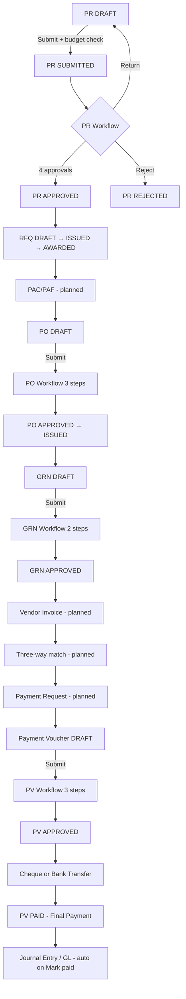

The full path from **PR Draft** through **final payment** is documented in `docs/03_Workflows.md` and partially implemented in code. Below is the end-to-end picture, with what is **live in the app today** vs **designed but not fully built**.

---

## Master flow (business intent)

From the system design:

```
Grant → Project/Activities → Annual Procurement Plan (APP)
  → Purchase Requisition (PR)
  → RFQ / Vendor quotations
  → Purchasing Analysis Committee (PAC / PAF)
  → Purchase Order (PO)
  → Goods Receipt (GRN)
  → Vendor Invoice → Three-way match (PO ↔ GRN ↔ Invoice)
  → Payment Request
  → Payment Voucher
  → Cheque / Bank Transfer
  → Journal Entry → General Ledger
```

---

## Phase 1 — Purchase Requisition (PR)

### Document states
All major documents share the same state machine:

```
DRAFT → SUBMITTED → APPROVED / REJECTED / RETURNED
```

On **RETURN**, the PR goes back to **DRAFT** (or RETURNED status) so the requester can fix and resubmit.

### PR lifecycle (implemented)

| Step | Who | What happens |
|------|-----|----------------|
| **0. DRAFT** | Requester (Staff, Project Manager, etc.) | Create PR via wizard: general info, line items, budget check, optional attachments |
| **1. Submit** | Requester | Budget availability is checked (if a budget line is linked). Status → **SUBMITTED**. Workflow `PURCHASE_REQUISITION` starts |
| **2–5. Approval workflow** | See table below | Each approver can Approve, Return, or (at some steps) Reject |
| **Final approval** | Last approver | PR → **APPROVED**. Budget is **committed** on the grant budget line |

### PR approval steps (seeded in DB)

These are the **actual** workflow steps from `prisma/seed/lookup-data.ts`:

| Step | Approver role | SLA | Can return? | Can reject? |
|------|---------------|-----|-------------|-------------|
| 1 | **Department Head** | 48h | Yes | No |
| 2 | **Procurement Officer** | 24h | Yes | No |
| 3 | **Finance Officer** | 24h | Yes | Yes |
| 4 | **Country Director** | 48h | Yes | Yes |

Approvers act from the **Approvals** page (`/approvals`). Each action is logged with a digital signature.

> Note: The new PR wizard preview text mentions “Program Manager and Finance Officer” — that is **outdated**. The real flow uses the four roles above.

---

## Phase 2 — Sourcing (after PR is APPROVED)

| Step | Document | Status flow | Workflow? |
|------|----------|-------------|-----------|
| **RFQ created** | Request for Quotation | Requires PR = **APPROVED** | No workflow — manual |
| **RFQ issued** | RFQ sent to vendors | DRAFT → **ISSUED** | No |
| **Quotations** | Vendors invited, quotes entered | Per-vendor scores | No |
| **Vendor awarded** | Winning vendor selected | RFQ → **AWARDED** | No |
| **PAC / PAF** | Purchase Analysis Form | Model exists in DB | **Not implemented** as a service/workflow yet |

Code gate: RFQ can only be created when `pr.status === 'APPROVED'` (`rfq.service.ts`).

---

## Phase 3 — Purchase Order (PO)

| Step | Who | What happens |
|------|-----|----------------|
| **Create PO** | Procurement Officer | PO created from approved PR / RFQ / PAF, linked to vendor. Status = **DRAFT** |
| **Submit PO** | Procurement Officer | Status → **SUBMITTED**. Workflow `PURCHASE_ORDER` starts |
| **Approve PO** | See workflow below | Final approval → **APPROVED** |
| **Issue PO** | Procurement Officer | **APPROVED** → **ISSUED** (sent to vendor) |

### PO approval steps (seeded)

| Step | Approver role | SLA |
|------|---------------|-----|
| 1 | **Procurement Manager** | 24h |
| 2 | **Finance Manager** | 24h |
| 3 | **Country Director** | 48h |

---

## Phase 4 — Goods receipt (GRN)

| Step | Who | What happens |
|------|-----|----------------|
| **Create GRN** | Warehouse / receiving staff | Against an **APPROVED** or **SUBMITTED** PO. Status = **DRAFT** |
| **Submit GRN** | Receiver | Status → **SUBMITTED**. Workflow `GOODS_RECEIPT` starts |
| **Approve GRN** | See workflow below | On final approval: PO received quantities updated; PO may become partial/complete |

### GRN approval steps (seeded)

| Step | Approver role | SLA |
|------|---------------|-----|
| 1 | **Department Head** (inspection) | 24h |
| 2 | **Procurement Officer** (finalize) | 24h |

---

## Phase 5 — Invoice & payment prep (designed, partially built)

| Step | Document | Implementation status |
|------|----------|------------------------|
| **Vendor invoice entered** | `VendorInvoice` | Schema exists; **no backend service/UI yet** |
| **Three-way match** | PO ↔ GRN ↔ Invoice | Designed in docs (`isThreeWayMatched` field on invoice); **not automated in code** |
| **Payment request** | `PaymentRequest` | Schema exists, links invoice → payment voucher; **no dedicated API/UI yet** |

Design doc (`WF-005`) adds an invoice approval workflow (Finance Officer → Procurement Officer → Finance Manager), but that template is **not seeded** — only PR, PO, GRN, and Payment Voucher templates are in the seed data.

---

## Phase 6 — Payment Voucher → Final payment (implemented)

| Step | Who | What happens |
|------|-----|----------------|
| **Create PV** | Finance Officer | Payment Voucher created (optionally linked to Payment Request). Status = **DRAFT** |
| **Submit PV** | Finance Officer | Status → **SUBMITTED**. Workflow `PAYMENT_VOUCHER` starts |
| **Approve PV** | See workflow below | Final approval → **APPROVED** |
| **Execute payment** | Cashier / Finance | `markPaid()` — creates **Cheque** or **Bank Transfer** record. PV → **PAID** |

### Payment voucher approval steps (seeded)

| Step | Approver role | SLA |
|------|---------------|-----|
| 1 | **Finance Manager** | 24h |
| 2 | **Internal Auditor** | 24h |
| 3 | **Country Director** | 48h |

### Final payment execution
After PV is **APPROVED**, finance executes via:
- **Cheque** — cheque record issued with serial number, or
- **Bank transfer** — transfer record created and marked completed

That is the **final cash-out step** in the current codebase.

---

## Phase 7 — Accounting (designed, partial)

Design says: journal entry posted (Debit AP, Credit Bank), GL updated, bank register updated.

**Today:** Journal entry and GL modules exist in schema/UI scaffolding, but automatic posting from payment is **not fully wired** in the payment service — `markPaid()` creates payment/cheque/transfer records and audit logs, but does not auto-create journal entries yet.

---

## Visual summary



---

## Quick reference: who approves what

| Document | Final sign-off role |
|----------|---------------------|
| Purchase Requisition | Country Director |
| Purchase Order | Country Director |
| Goods Receipt | Procurement Officer |
| Payment Voucher | Country Director (then finance executes payment) |

---

## Practical takeaway

If you start from **PR Draft** today in IPFMS, the **fully working path** is:

**PR (draft → 4-step approval) → RFQ (manual) → PO (3-step approval → issue) → GRN (2-step approval) → Payment Voucher (3-step approval) → Cheque/Bank Transfer (PAID).**

The middle steps **Vendor Invoice**, **three-way match**, and **Payment Request** are in the data model and design docs but are **not yet built** as user-facing workflow steps — payment vouchers can be created directly in the finance module today.

If you want, I can map this to the exact UI routes and demo user accounts (e.g. which login approves each step).